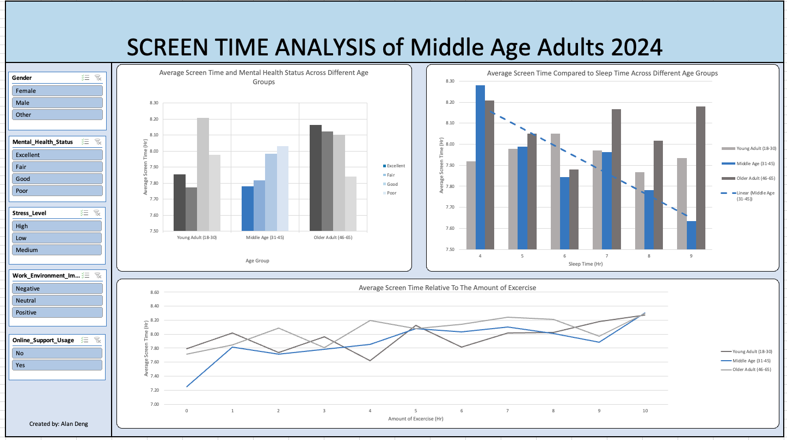

# Screen Time Analysis Dashboard

## Background and Overview

This dashboard analysis focuses on **middle-aged adults** and compares their screen usage patterns to those of young adults and older adults to assess whether **middle-aged adults** are the most impacted, despite the demands of their busy lives.

### Dashboard Overview

The dashboard features a set of filters on the left-hand side, allowing users to refine the data by gender, mental health status, stress level, work environment impact, and on-support usage.

The dashboard presents three key visualizations:

- A grouped bar Chart displaying the average screen time for each age group, segmented by mental health status.
- A grouped bar chart illustrating the relationship between average screen time and the amount of sleep across age groups.
- A line chart showing the trend of average screen time in relation to the amount of exercise preformed by each age group.

## Data Structure Overview

The dataset consists of answers about screen time usage from 10000 adults ranging from the ages of 18-65.

The age range is broken down in the following categories:

- Young Adults (18-30)
- Middle-aged Adults (31-45)
- Older Adults (46-65)

Key fields include:

- Age
- Age Group
- Gender
- Technology Usage (Hours)
- Social Media Usage (Hours)
- Gaming Usage (Hours)
- Screen Time Usage (Hours)
- Sleep (Hours)
- Physical Activity (Hours)
- Mental Health Status
- Stress Level
- Support System
- Work Environment Impact

## Executive Summary

### Overview of Findings

- **Middle aged adults who are prioritizing more sleep tends to average lower screen time overall:** This suggests that individuals who focus on maintaining healthy sleep patterns may be more intentional with thier screen usage, limiting it to essential activities, and dedicating more time to rest and recovery.

- **Middle aged adults with stronger mental health show a tendency to engage in less screen time:** Lower screen time may correlate with better mental well-being, as reduced exposure to potentially stressful or overwhelming digital content could help foster healthier mental states.

- **Daily physical activity has a minimal impact on screen time, as many individuals continue to use devices during exercise:** Despite engaging in physical activity, middle aged adults often incorporate screen usage such as listening to music, podcast, or fitness apps.

## Recommendations

- **Researchers** can study the impact of screen time on sleep across age groups to study the relationship between technology us and health.

- **Public health agencies** can use the data to design age specific interventions to promote healthier habits

- **Employers** can use this data to analyze how screen time impacts productivity and well being among middle age employees.
